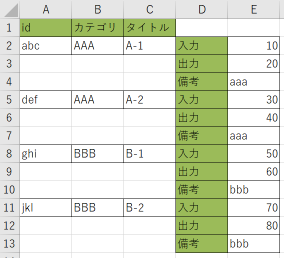
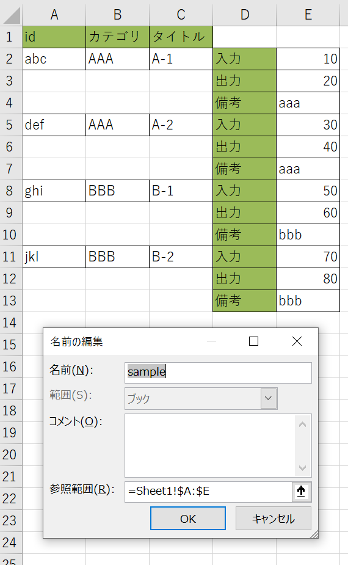
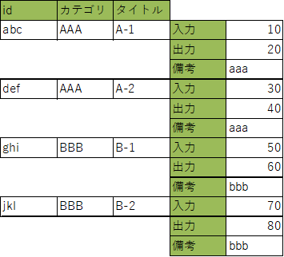
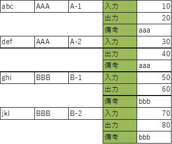
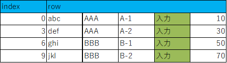
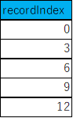
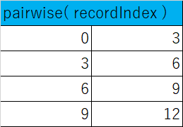
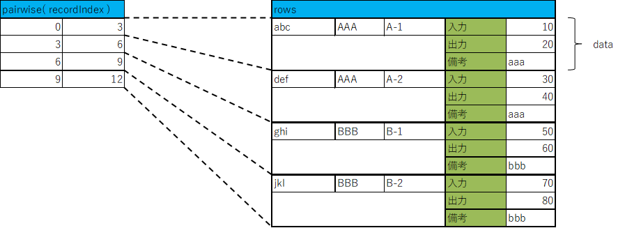

# 背景
業務では帳票を元にツールを動かしたり、設定ファイルを作成したりする際、
書きやすさの都合で複数行で1レコードのデータを書きたい場合がある。

こうしたデータをVBAではなくPythonで扱いたい場合にどのようにすればよいか順を追って示す。



# 前提
下図のように、1レコードが複数行にわたって書かれており、今後の要素追加を考慮して列全体がブックをスコープとした`sample`と名前定義されている場合を考える。



# 値の取り出し方
## 範囲を取得する
名前定義`sample`の範囲は`refers_to_range`で取得できるが、このまま値を取得しようとすると列全体を対象としてしまうため、範囲を絞る必要がある。

値が描かれた範囲に絞るには以下のように`Range`オブジェクトの`current_region`を取得する。

```py
import xlwings as xw
from dataclasses import dataclass

wb = xw.Book( 'sample.xlsx' )
name = wb.names[ 'sample' ]

# 値のある範囲に絞る
range = name.refers_to_range.current_region
```

この時点で`range`は下図の範囲に絞られる。



## ヘッダ以外の値を二次元配列として取得する
`range`の`value`を取得することで、範囲内の値を二次元配列として取得できるが、ヘッダは不要なのでスライスで2行目以降を取得する。

```py
import xlwings as xw
from dataclasses import dataclass

wb = xw.Book( 'sample.xlsx' )
name = wb.names[ 'sample' ]

# 値のある範囲に絞る
range = name.refers_to_range.current_region

# ヘッダ以外を二次元配列として取得
rows = range.value[1:]
```



## 各レコードの範囲を調べる
### レコードの先頭行のインデックスを得る
`xlwings`では空のセルは`None`になるので、レコードの先頭(`id`が空ではない)行をリスト内包表現で以下のように取得できる。

`enumerate`で行とインデックスの内、`row`の1列目が`None`ではないインデックスのみ残すことで、先頭行の行番号のインデックスをまとめた`recordIndex`が得られる。

```py
import xlwings as xw
from dataclasses import dataclass

wb = xw.Book( 'sample.xlsx' )
name = wb.names[ 'sample' ]

# 値のある範囲に絞る
range = name.refers_to_range.current_region

# ヘッダ以外を二次元配列として取得
rows = range.value[1:]

# レコードの先頭行のインデックスの配列を作る
recordIndex = [ index for [ index, row ] in enumerate( rows ) if row[0] is not None ]
recordIndex.append( len( rows ) )
```


この後の処理のため`recordIndex`に、最後のレコードの次の行(`len( rows )`)を追加しておく。



### レコードの範囲を得る
レコードの先頭行の配列`recordIndex`から、イテレータの`itertools`の`pairwise`を使って、2つ1組にすることで、開始行～次の開始行(終了行+1)のペアが得られる。



### レコード作成する
`pairwise`で得られたレコードの開始行と次のレコードの開始行(レコードの終了行+1)を得られたら、スライスにより1レコード分のデータが取得できるので、データの原点からの相対位置で値を取得し、レコードにセットしていく。



```py
@dataclass
class Record:
    key: int
    category: str
    title: str
    input: float
    output: float
    remark: str

wb = xw.Book( 'sample.xlsx' )
name = wb.names[ 'sample' ]

# 値のある範囲に絞る
range = name.refers_to_range.current_region

# ヘッダ以外を二次元配列として取得
rows = range.value[1:]

# レコードの先頭行のインデックスの配列を作る
recordIndex = [ index for [ index, row ] in enumerate( rows ) if row[0] is not None ]
recordIndex.append( len( rows) )

# レコードの配列を作成
records: list[ Record ] = []
for [ start, end ] in pairwise( recordIndex ):
    # 開始行～終了行(含まない)でスライス
    data = rows[ start:end ]

    # スライスしたデータからRecordを作成    
    records.append( Record(
        key = data[0][0],
        category = data[0][1],
        title = data[0][2],
        input = data[0][4],
        output = data[1][4],
        remark = data[2][4]
    ) )
```

# 実行結果
以下のようになり、Excelの表で書いていた内容がデータとして取り出せていることが分かる。

```py
for record in records:
    print( record )

# --------------------------------------------------------------------------------------
# Record(key='abc', category='AAA', title='A-1', input=10.0, output=20.0, remark='aaa')
# Record(key='def', category='AAA', title='A-2', input=30.0, output=40.0, remark='aaa')
# Record(key='ghi', category='BBB', title='B-1', input=50.0, output=60.0, remark='bbb')
# Record(key='jkl', category='BBB', title='B-2', input=70.0, output=80.0, remark='bbb')
```